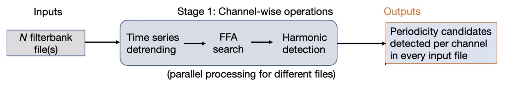
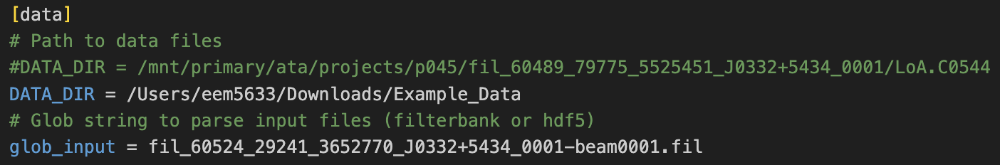
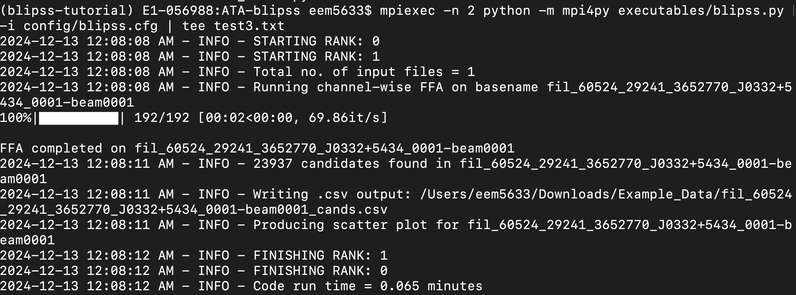
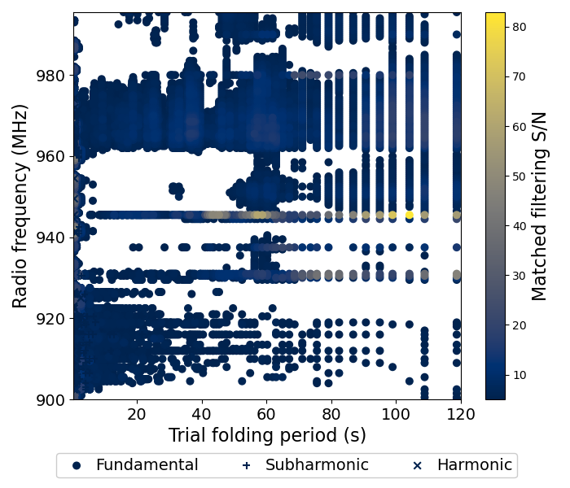
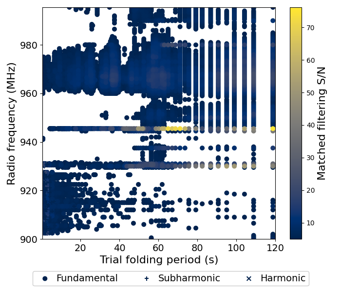
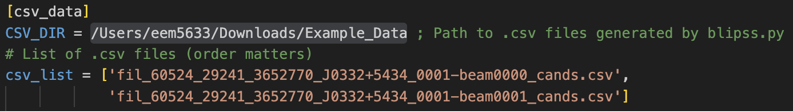
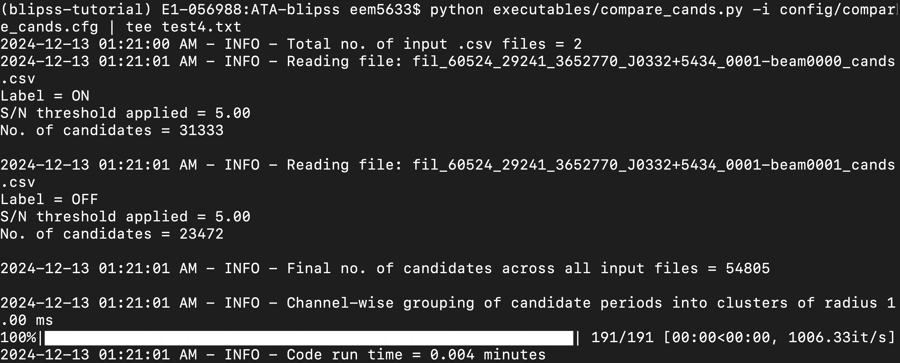
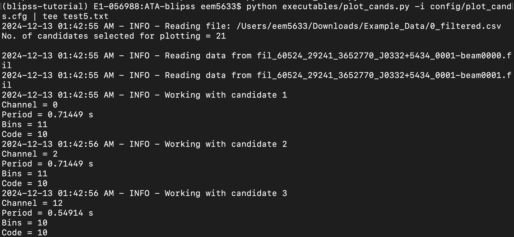
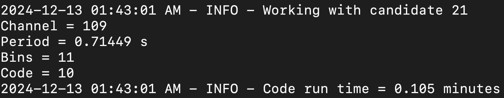
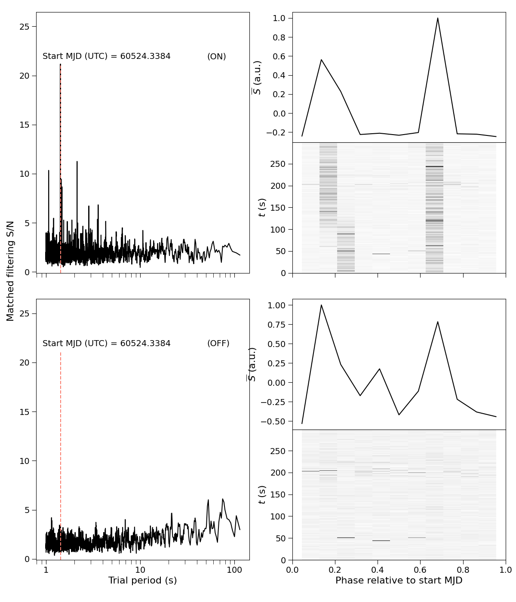

# Running BLIPSS


In order to validate the `blipss` pipeline, we will be working with two test data files derived from a pulsar observation of PSR J0332+5434
The dataset consists of two filterbank files `.fil` corresponding to the on-beam--pointing toward
PSR J0332+5434 and exhibiting a strong, periodic signal--and the off-beam, which is pointed away from the pulsar, thereby providing a control sample where no strong periodic signal
should be detected. The test dataset can be downloaded from [this shared Google Drive folder](https://drive.google.com/drive/folders/1F-HHBgHHC0STbcoE6kM9zHHpCm0u_uVf).


## Blipss structure

The BLIPSS package currently contains six chief executable files. Each script in the `executables` folder has an associated `.cfg` file located in the
`config` folder that allows you to modify the parameters for the corresponding `.py` script. 
For example, the `config/blipss.cfg` file allows you to modify the parameters of
the fast folding algorithm (FFA), such as the minimum and maximum trial folding period
for the FFA search, and it also allows you to specify whether you'd like to deredden the time
series before searching.

## Step 1: Execute `blipss.py`

Now that you've installed blipss on your computer and already downloaded the test dataset, the first thing you need to do is run the `executables/blipss.py` file.
This script executes a channel-wise FFA on input data files (in our case, the `.fil` files), identifies harmonics of 
detected periods, and outputs a .csv file with a list of candidates. An schematic of the `blipss.py` workflow
is shown below:

{ width="800" }
/// caption
A schematic representation of the blipss workflow. A sequence of N input filterbank files is processed channel-wise
to search for periodic signals. Operations on different input files are parallelizable across multiple cores of a machine. Stage 1 outputs a list of periodicity candidates
detected per channel for every input file. This diagram was taken from (Suresh et al. 2023).
///


To ensure a successful run, you will first
have to open the `config/blipss.cfg` file and modify the path for the input data. For
example, if you stored the test data in your `Downloads` folder, then the snippet for your
input data should look like this:

{ width="800" }
/// caption
Block of code for the input data in the `blipss.cfg` file.
///

You must do the same for the `OUTPUT_DIR` variable in the same `.cfg` file and enter the path to the location where you want to store the output of the `blipss.py` script.
Once you've made these modifications, you will save the file and then run the 
`blipss.py` script as follows

```
mpiexec -n <nproc> python -m mpi4py executables/blipss.py -i config/blipss.cfg | tee <Log file>
```

where `<nproc>` specifies the number of processes that will be used in this run (e.g., you can
set it to `2`) and `<Log file>` is the name of the text file where the output of the command
above will be printed (e.g., you can call it `output1.txt`).

If this command is executed successfully, you should get an output that looks like this


{ width="800" }
/// caption

///

This will produce two `.csv` files whose name ends with `beam0000_cands.csv` and 
`beam0001_cands.csv`. Each of these files contain the information about the radio
frequency used (in MHz), the number of bins, the best width, the period of the pulsar (s), the
signal-to-noise ratio (S/N), and the harmonic flag for a specific channel. In addition to these `.csv` files, you should obtain two plots that look like this

{ width="400" }
/// caption
Off-beam
///

{ width="400" }
/// caption
On-beam
///

## Step 2: Execute `compare_cands.py`

Now that we've processed the data for the two candidates, we have to compare them by running
the `executables/compare_cands.py` script. This script compares the periodicity detections across
a set of N `.csv` files generated by `blipss.py`. For every unique candidate period, an N-digit
binary code is generated, wherein ones and zeros represent detections and non-detections,
respectively.

As with the `blipss.py` script, we first need to modify the `.cfg` file by editing the path to the blipss repo in your local machine. To do this we have
to open the `config/compare_cands.cfg` file and enter the path to the directory where the `.csv` files generated by 
`blipss.py` were stored. This is shown in the following code snippet

{ width="800" }
/// caption
Block of code for the input data in the `compare_cands.cfg` file.
///

Once you've edited the path in the `.cfg` file, you are now ready to run the `compare_cands.py`
script. To run execute this, you need to type the following command in the terminal

```
python executables/compare_cands.py -i config/compare_cands.cfg | tee <Log file>
```
where `<Log file>` is the name of the file where the output will be saved to.

If the run is successful, you should see an output message that looks like this

{ width="800" }
/// caption

///


This will produce a new `.csv` file whose name ends with `comparecands.csv`. 

## Step 3: Execute `filter_cands.py`

Next, we have to run the `filter_cands.py` script. This script is going to narrow down the search of periodic signals
by selecting the channels that have a `S/N>20` and have code `10`. To run this script, we have
to type the following command in the terminal

```
python filter_cands.py
```

This will output yet another `.csv` file whose name ends with `filtered.csv`.

## Step 4: Plot the results

Now that we've managed to filter the candidates that have a `S/N>20` and code `10`, it's time
to plot the results for these candidates. The script that we have to run is called `plot_cands.py` and
it has an associated `.cfg` file that needs to be modified with the correct path to your local
version of the blipss repo. Once you make these edits (following the same process as with
previous scripts), you have to run the following command in the terminal

```
python executables/plot_cands.py -i config/plot_cands.cfg | tee <Log file>
```
If everything goes well, you should see the following output


{ width="800" }
/// caption

///


{ width="35" }
/// caption

///

{ width="800" }
/// caption

///

In the example above, we had 21 candidates, so after running the `plot_cands.py` script, you will obtain one
plot for each of the 21 candidates that looks like this

{ width="600" }
/// caption
Plot of the `P = 1.42938 s` candidate signal. The left column shows periodograms derived from each data file, the
ON-beam and OFF-beam. The candidate period is indicated by the red dashed vertical lines. The right column shows the
average pulse profiles (top subplot) and phase-time diagrams (bottom subplot).
///

A “true” signal would appear as a strong peak in the periodogram at the determined period, as
well as a vertical bar in the phase-time diagram for the ON-beam (top subplots) but not the OFF-beam (bottom
subplots). Figure 1 shows one plot of the signal with `P = 1.42938 s`. As we can see in this case,
the red dashed coincides with the the most prominent peak in the periodogram, which indicates that
pulsed radio signals were detected. 

At this point, you'll have the pipeline working and validated!

